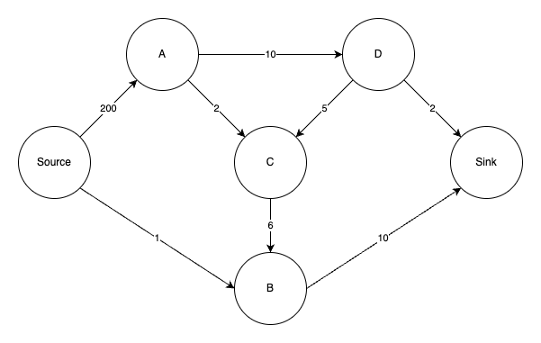
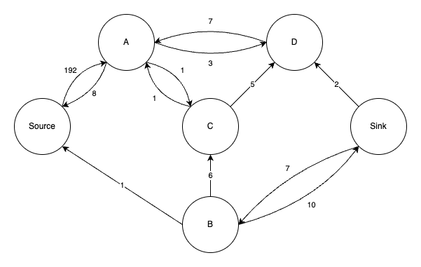
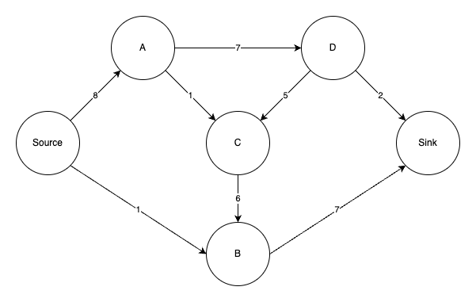

# max-flow
Java implementation of the [push-relabel maximum flow algorithm](https://en.wikipedia.org/wiki/Push%E2%80%93relabel_maximum_flow_algorithm)
for computing maximum flows in a flow network. It is considered to be one of the most efficient maximum flow algorithms.

---
Flow network is a directed graph where every edge has a capacity. It has two special nodes: a source node and a sink node.
Stuff is coming out of the source and goes into the sink node. 
There are also no edges that coming out and into the same node.
The graph does not contain parallel edges – two or more arcs with the same tail and head nodes.


Given a flow network this algorithm will determine how much stuff is possible to send from a source to a sink
without exceeding the capacity of any arc. For example for the graph above the maximum flow would be 4. For the network below it would be 9



By the time the algorithm terminates the original network gets transformed into residual graph.
For the second example the residual graph would look like this:



Comparing it to the original network can be used for recover the actual flow. Here's how the flow would look like for our example:



## Quick start

```xml
<dependency>
    <groupId>org.open-structures</groupId>
    <artifactId>max-flow</artifactId>
    <version>1.0.0</version>
</dependency>
```


The first step is to create a flow network for which we'd like to find max flow.

    FlowNetwork flowNetwork = new FlowNetwork(source, sink);
    flowNetwork.setArcCapacity(200, source, nodeA);
    flowNetwork.setArcCapacity(1, source, nodeB);
    flowNetwork.setArcCapacity(10, nodeA, nodeD);
    flowNetwork.setArcCapacity(2, nodeA, nodeC);
    flowNetwork.setArcCapacity(10, nodeB, sink);
    flowNetwork.setArcCapacity(6, nodeC, nodeB);
    flowNetwork.setArcCapacity(5, nodeD, nodeC);
    flowNetwork.setArcCapacity(2, nodeD, sink);

Next pass it to the algorithm and calculate the max flow amount:

    PushRelabelMaxFlow flow = new PushRelabelMaxFlow(flowNetwork);
    flow.preflowPush();
    flow.getFlowAmount() // would return 9 

Remember that the `flowNetwork` arc capacities will be modified as the algorithm does its thing and you end-up with the residual graph.